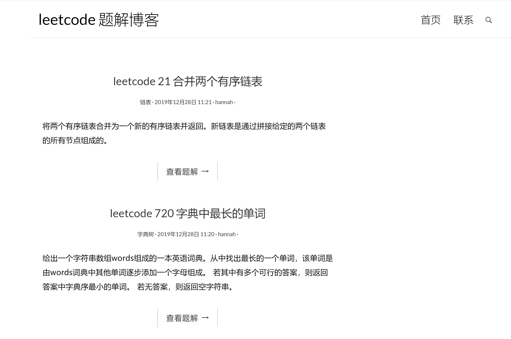
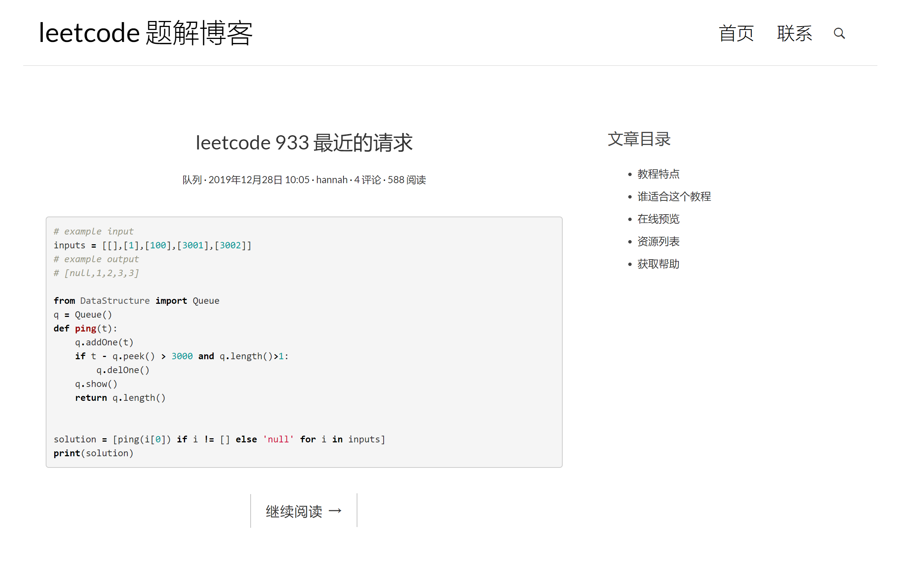

# 项目目的

 - 提供一个高度封装的轻量python数据结构模块
 - 搭建leetcode数据结构题解教程网站

# 项目指南

> 下载环境和项目文件

 - 下载项目环境依赖LeetcodeBlogEnv并解压
 - 下载博客项目LeetcodeBlog并解压

> 进入虚拟环境

```bash
    cd [LeetcodeBlogEnv路径]/Scripts
    activate  #启动虚拟环境
```

> 项目依赖

```
    Django == 1.10.6
    Markdown == 3.1.1
    Pygments == 2.5.2
```

*如果虚拟环境启动成功则不需要关注项目依赖*

> 开启Django网络服务器

```bash
    python manage.py runserver #使用manage.py脚本打开django服务器 
```

> 网页界面





# 项目流程

> python实现DataStructure数据结构模块

 - 栈
 - 链表
 - 队列
 - 树
 - 字典树

> 用DataStructure模块解答leetcode问题

 - `栈` 20 effectiveParentheses 有效的括号
 - `链表` 21 mergeTwoList 合并两个链表
 - `字典树` 720 logestWord 最长的单词
 - `队列` 933 recentCounter 最近的请求

*题目具体内容可见代码头部注释*<br>
*代码均在LeetcodeBlog/SourceCode目录下*

> virtualenv创建虚拟环境

 - 为了减少未来部署服务器时环境依赖问题

> SQLite构建leetcode题解博客系统的数据库

 -  存储题解数据的表

| 题解id | 标题 | 题解 | 题目描述 | 发表时间 | 
| :-----: | :----: | :----: | :-----:| :-----:|
| 223 | 括号匹配问题 | python代码 | 题目描述 | 2019.12.26|

 -  题解分类表

| 题解id | 分类|
| :-----: | :-----:|
| 223 | 栈 |
 
 -  题解标签表

| 题解id | 分类|
| :-----: | :-----:|
| 223 | 简单 |

> Django搭建leetcode题解博客网站

 - 部署开发环境
 - 构建博客首页试图
 - 构建博客详情页面
 - 配置博客页面对markdown语法和代码高亮的支持

